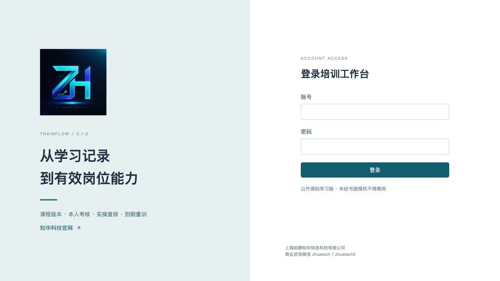
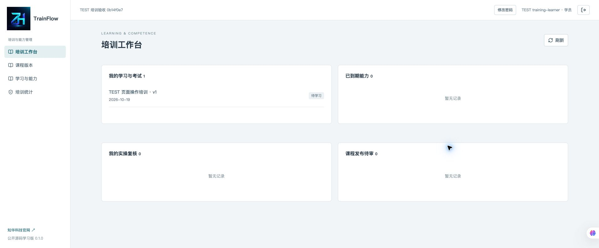
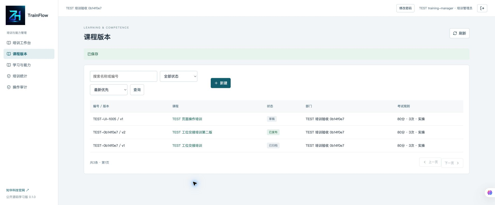
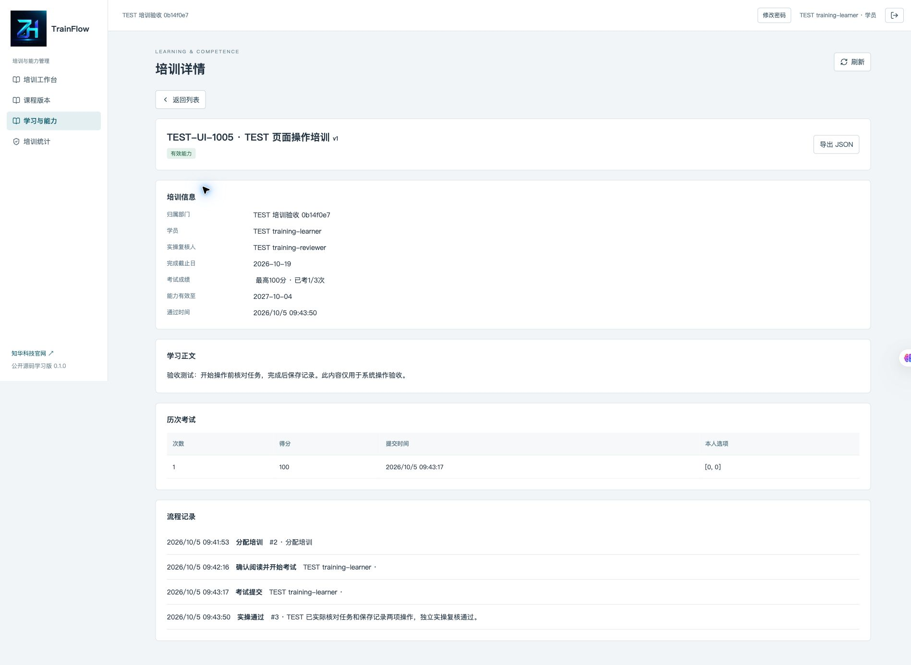
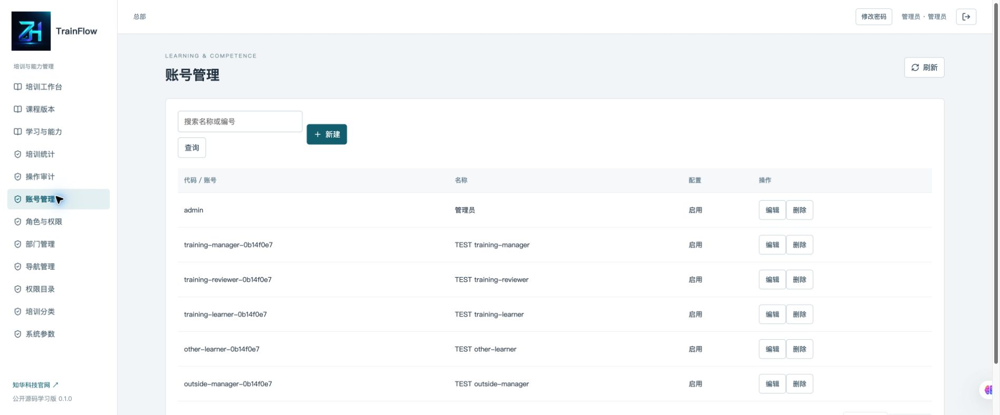
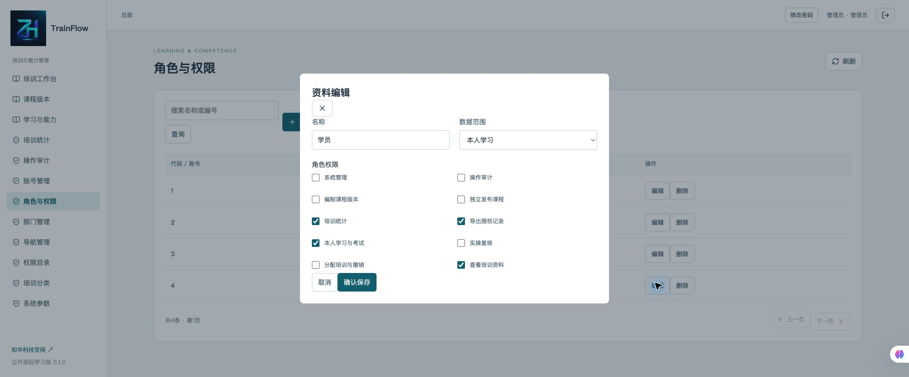
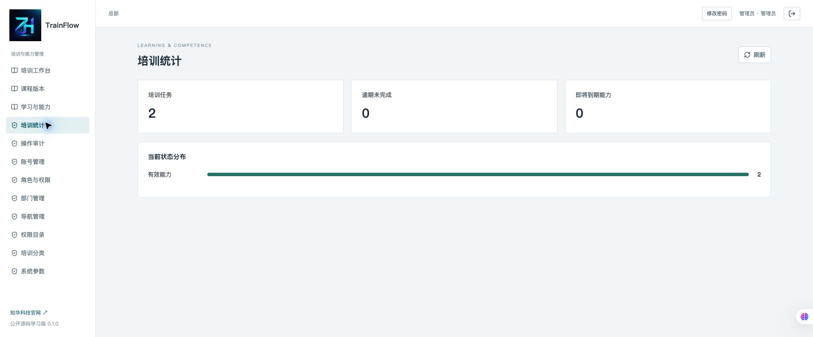

[中文](README.md) | [English](README.en.md)


# TrainFlow · 知华企业培训与能力考核

**公开源码学习版 0.1.0** · 知华科技（上海如静知华信息科技有限公司） · [知华科技官网](https://www.zhuatech.cn/) · 商业咨询微信 **zhuatech / zhuatech2**。

培训管理员需要知道员工学的是哪一版内容、有没有通过考试、实操由谁核对、能力记录何时到期。TrainFlow 将课程编制、独立发布、指定学习、后端评分和实操复核放进同一条记录，供中小企业培训负责人、部门主管及软件实施团队在隔离环境学习评估。

自有代码适用 [非商业源码许可证](LICENSE)，仅限个人学习、技术研究与非商业交流；未经书面授权不得商用。这不是 OSI 标准开源许可。第三方依赖遵循各自许可，见 [THIRD_PARTY_NOTICES.md](THIRD_PARTY_NOTICES.md)。

## 一次培训怎样成为有效能力记录

```text
课程草稿 + 四选一题库 → 独立发布 → 指定学员及实操复核人
                                      ↓
                           本人确认阅读 → 本人提交考试
                                      ↓
                     未通过：剩余次数内重考 / 次数用尽失败
                                      ↓ 通过
                     无实操：直接合格 / 有实操：指定人复核
                                      ↓
                      有效能力 → 日期到期 → 新培训任务
                           ↘ 有理由撤销，保留原成绩
```

课程发布冻结正文、题目、标准答案、通过分数、考试次数和有效天数。新版发布时旧版归档，已有任务继续学习原版本，历次成绩不随新版改题变化。课程编号全实例唯一；版本号按编号递增，每个编号最多一份未发布新版。

确认阅读是学员主动提交的记录，不证明阅读时长或身份核验。考试没有计时、随机抽题或监考；每题同权，分数取正确比例的整数百分比。服务端计算成绩，学员接口及导出不包含标准答案。已发布题目可由具有课程编制权限的非SELF账号查看标准答案。

能力记录是企业内部培训资料，不是法定岗位资格、职业证书或电子签名，不替代真实现场考察。实操证据目前为文本引用，实际核对由指定复核人完成。

## 可操作内容与岗位

| 岗位 / 模块 | 当前实现 |
|---|---|
| 培训管理员 | 草稿增改删、2–30道四选一题、编号和版本、课程归档、新版复制、分配、取消未完成培训、撤销能力 |
| 培训复核员 | 不能发布自己编写的版本；指定实操通过或未通过，证据必填；不能复核本人或由本人分配的任务 |
| 学员 | SELF范围，仅查看本人分配的课程和培训；阅读确认、完整作答、重考、本人历史与JSON导出 |
| 部门 / 全范围岗位 | 课程与任务数据库分页、名称和编号搜索、状态过滤、新旧排序、培训统计、到期与逾期指标、审计 |
| 系统后台 | 用户、角色及权限、部门、登记菜单、权限名称、培训分类字典、系统参数、个人改密 |
| 一致性 | 数据库共享写锁、乐观版本、绑定操作者与完整载荷的UUID请求键；精确重试不多扣考试次数 |

同一学员、同一课程版本已有未完成或有效任务时拒绝重复分配。失败、取消、撤销或过期后可重训。截止日含当天，超过日期后不能确认阅读、考试或实操复核；管理员可说明原因取消旧任务后重新分配。合格有效期从服务器上海日期起算，包含第一天和截止当天。

管理员的全范围权限不能代替指定学员考试或指定实操复核人。数据范围和业务权限共同生效；SELF即使被分配额外写权限，仍不能编制、发布或分配他人培训。系统无自动改写过期记录的定时任务，过期状态由读取时的日期计算。

**尚未实现**：视频课程、课件上传、直播、SCORM、题库导入、随机考试、防作弊监考、签名证书、法定资质校验、外部消息通知、多租户、排班资格自动同步、ERP/HR接口及AI评分。无第三方业务账号或付费模型依赖。所有核心业务本地运行；课程正文由部署方自行编制。

## 运行页面

以下来自隔离MySQL实例的当前运行页面，记录以 `TEST` 标识，均为虚构验收数据。登录页完成岗位认证；工作台展示本人培训与复核待办；课程页维护固定版本；学习页完成阅读、答题与成绩查询；账号及角色页维护访问范围；统计页聚合授权数据。

### 学员和课程









### 管理和统计







## 从空数据库启动

环境：Docker Engine 27+、Compose 2+，至少4GB可用内存。开发环境：Java 21、Maven 3.9、Node.js 24.19.0+、npm 11、Python 3.11+；前端锁文件固定版本。后端 Spring Boot 4.0.7、Spring Security、JPA，前端 Vue 3.5.40 / Vite 8.1.5，MySQL 8.4 属于MySQL 8系列，MariaDB JDBC 3.5.10，Flyway版本化迁移，Nginx代理。

```sh
python3 scripts/init-env.py
# 从仅本机可读的 .env 查看 ADMIN_PASSWORD，不上传该文件。
docker compose -p trainflow up --build -d
```

访问 `http://127.0.0.1:8106`，健康检查 `http://127.0.0.1:8106/actuator/health`。初始化账号 `admin`，密码来自 `.env` 的 `ADMIN_PASSWORD`。生成器创建三个独立随机密码、权限0600，并拒绝覆盖现有文件。没有固定公开密码。账号密码至少12位、包含大小写字母与数字、最多72个UTF-8字节。重启不重置账号；修改初始化环境变量不会修改已有管理员密码。

首次初始化只有总部、四个角色、权限、导航、分类字典、三个参数及管理员；不会生成成绩或业务课程。管理员先建立部门及培训管理员、复核员、学员账号，再由这些岗位实际操作。

配置名称见 [.env.example](.env.example)：`DATABASE_PASSWORD`、`MYSQL_ROOT_PASSWORD`、`ADMIN_PASSWORD` 必填；`WEB_PORT` 默认8106，`BIND_ADDRESS` 默认127.0.0.1，`COOKIE_SECURE` 本机HTTP为false，正式HTTPS为true。数据库名 `zhuatech_trainflow`，容器间账号 `trainflow`。后端数据库、管理员凭据与服务器配置说明见[部署手册](docs/deployment.md)。

前端开发：`cd frontend && npm ci && npm run dev`，本机Vite代理指向后端8080；后端需环境变量配置MySQL连接，`cd backend && mvn spring-boot:run`。详见部署手册，不依赖电脑已有数据库。

## 数据与升级

建表和升级脚本：`backend/src/main/resources/db/migration/`，V1建立身份管理，V2建立课程、题目、培训、考试、命令凭据及事件，V3增加课程题目编辑修订计数。Flyway按版本执行，JPA仅validate，不自动修改表结构。保留已执行脚本校验和，新增迁移升级；升级前备份MySQL并在副本演练，禁止清空业务卷。关联外键保护人员及版本引用，考试和事件只追加。

列表默认20条，最大100条；搜索、状态及分页在数据库执行。统计、待办及选择目录最多10,000条，超过统计上限明确拒绝。审计读取最近1,000条并可在页面搜索分页；课程题目最多30题，单个任务详情保留全部考试历史（最多10次）。单企业、多部门形态；当前采用共享写锁，适合学习和小规模评估，大规模使用需专项性能及灾备建设。

## 验证、运行维护与安全

```sh
# Maven需要Java21；测试密码在本次进程随机生成，不提交。
TEST_ADMIN_PASSWORD="Aa9$(python3 -c 'import uuid; print(uuid.uuid4())')" mvn -f backend/pom.xml spotless:check test package
cd frontend
npm run format:check
npm run lint
npm test
npm run build
cd ..
docker compose -p trainflow config --quiet
# smoke只允许localhost，在独立全新测试数据库运行一次。
python3 scripts/smoke.py
# 重启同一测试数据库后核对成绩持久化。
python3 scripts/smoke.py --verify
python3 scripts/release-check.py
```

[验收说明](docs/testing.md)列出测试范围。[操作手册](docs/operations.md)、[业务接口](docs/api.md)、[架构](docs/architecture.md)、[安全边界](docs/security.md)。Docker构建同时执行后端测试及前端格式、静态检查、测试和构建，不跳过测试。

会话使用BCrypt12、HttpOnly/SameSite Strict Cookie、CSRF与登录限流。30分钟会话，停用与密码重置即时失效；管理员接口还需ALL范围。真实环境变量、凭据与验收状态均忽略，不提交客户或员工隐私。Nginx只在本机开放前端端口，MySQL不映射主机端口。正式部署请使用HTTPS、受控反向代理、备份及权限评审。

无法登录：核对私有 `.env` 和数据库中现有账号，不要期待重启改密。服务不健康：查看 `docker compose -p trainflow logs backend mysql`，核对凭据、迁移及端口；日志不得公开原样上传。提示版本冲突：刷新记录重新操作。无法分配：核对课程发布状态、人员启用与权限、部门和独立复核人。逾期任务先取消重分配，不回改历史日期。

## 贡献、问题和授权

贡献请先建立Issue说明业务问题，再提交可验证的增量修改，保持测试与署名，保留第三方许可。公开Issue使用虚构或脱敏数据，不贴密码、会话、员工资料或数据库备份。安全漏洞请通过下方商业咨询入口私下联系知华，不公开可利用细节。软件按现状提供，部署方负责内容合法性、业务核查、备份及运行安全，不承诺适合任意生产或认证场景。

## 联系知华科技

商业授权或深度定制开发请联系知华科技。

本项目由知华科技（上海如静知华信息科技有限公司）提供公开源码学习版本，主要用于个人学习、技术研究与非商业交流。未经书面授权不得商用。企业信息化建设、中小企业数字化转型、中小企业 AI 转型、私有化部署、软件外包、软件项目外包、软件实施、FDE 外包、OPC 技术支持及深度定制开发，请访问知华科技官网 [https://www.zhuatech.cn/](https://www.zhuatech.cn/)，或添加微信 zhuatech、zhuatech2 咨询。

| 微信 zhuatech | 微信 zhuatech2 |
|---|---|
|  |  |
